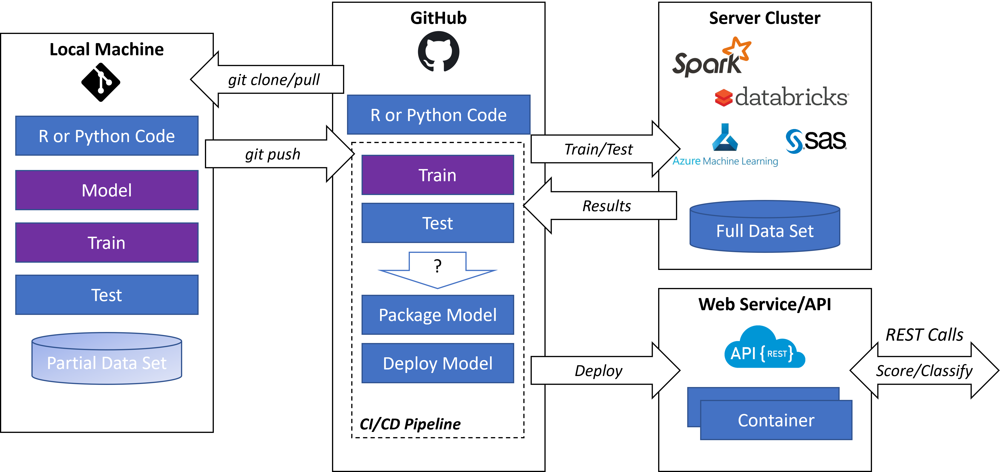

# Git Learning 
A simple repo designed to help with learning Git and GitHub along with references to samples, how-to documents and other similar documentation.  

## Learning Links
Tool | Location	| Purpose
-----|----------|-----------
Git  |	https://git-scm.com/downloads | Install Git tools on any non-Linux machine.
GUI Helpers | https://git-scm.com/downloads/guis | Make it easier to manage and learn Git through a graphical interface.
GitHub Cheat Sheet | https://education.github.com/git-cheat-sheet-education.pdf | List of the most common command line commands you will use with Git.
GitHub Learning Labs (hands-on)| https://skills.github.com/ | Great hands-on way to learn about merging, Pipeline/Actions, and many other more advanced topics in Git (your PC) or GitHub (the server).
Atlassian Git Tutorials | https://www.atlassian.com/git/tutorials | Solid tutorials on how to use Git on your PC for various purposes.
EdX Git Courses | https://www.edx.org/learn/git | Lots of pre-recorded video and screen sharing tutorials (think of it as a curated YouTube).

## Why Git?
Before getting into how to use Git, it's important to know how it's used.  It's used in all sorts of contexts, but here we will talk about it as it is used in software development (which was its origin) and in data science/machine learning in businesses today.

### In Software Development?
Originally developed as a way to collaborate with developers across the world and actually as a way to version code for Linux as it was being developed by open source contributors. A big advantage it had over other version control options at the time was its decentralized nature where it forced developers to fix any conflicts that ocurred before they "checked in" their code.  If 10 developers made a  change to a single file, it forced 9 of the developers to `merge` their changes with each file before they could submit their code for consideration. The processes surrounding this are termed DevOps which is short for Development Operations.

### In Data Science?
Large organizations found it was critical to manage the machine learning models (complex statistical algorithms) and found using many of the tools and processes that exist in software development could be applied to statistical models as well. In data science the usage of DevOps has been redesignated as Machine Learning Operations (MLOps). The following shows a diagram of what this general process looks like when using Git and GitHub.

## Git Usage
This section will cover some of the core concepts of Git repos and management of those repos.  It is not meant to be comprehensive however it should provide the reader a sufficient overview to begin working with it.

### Git Repo Lifecycle in a Concept
A git `local` and `remote` are essentially peers even though one is on a server (hosted in the cloud or on the Web).  While you work on a repo locally (on your own machine), periodically you will sync with the `remote` to both backup your work and to often share your work with others.  The following diagram shows this flow and the usual git commands one uses while working on the repo throughout that flow.

### Multi Repos
On any one individuals `local` machine, there are often multiple repos.  These can be from one `remote` service (such as GitHub) or can be from any number of other services (GitLab, Azure DevOps, etc.).  Each repo is stored in its own directory on the `local` machine and in concept would appear as the following

### Branching
To track changes, one makes changes to a separate `branch` of code in the repo

## Additional Links & Tips
Item | Location | Purpose
-----|----------|---------
Windows Terminal | [Windows Store](https://apps.microsoft.com/store/detail/windows-terminal/9n0dx20hk701) | A tabbed terminal window that works well with Git and Windows Subsystem for Linux.  (Windows Only)
VS Code | https://code.visualstudio.com/Download | Versatile multi-platform text editor supporting plugins and eases repo management.
Markdown Cheat Sheet | https://www.markdownguide.org/cheat-sheet | Markdown (or .md files) are the most common way to document files in repositories (including the one you are reading right now).  Markdown is also the same way [Jupyter Notebooks](https://jupyter.org/) support documentation in `.ipynb` text cells allowing data scientists to format the text in their notebooks.
Using LaTeX in Markdown | [https://www.fabriziomusacchio.com/blog/2021-08-10-How_to_use_LaTeX_in_Markdown/](https://www.fabriziomusacchio.com/blog/2021-08-10-How_to_use_LaTeX_in_Markdown/#how-to-use-latex-in-your-markdown-document) | The .md files you use and post to GitHub should automatically render any LaTeX equations you provide.  Simply encircle them with double dollar signs like `$$ your equation $$`.
DataBricks Deployment Example | https://docs.databricks.com/machine-learning/model-inference/index.html | Documentation on how to deploy a deep learning model inference endpoint by using the DataBricks Model Registry.  One of many ways to publish your model for use by consumers once complete. 
GitHub Student Dev Pack | https://education.github.com/pack | Free resources for students and teachers to leverage GitHub in the classroom.
GitHub Campus Experts Program | https://education.github.com/experts | Additional resources on how students can become an advocate for their school.  A good resume booster for undergrads.
